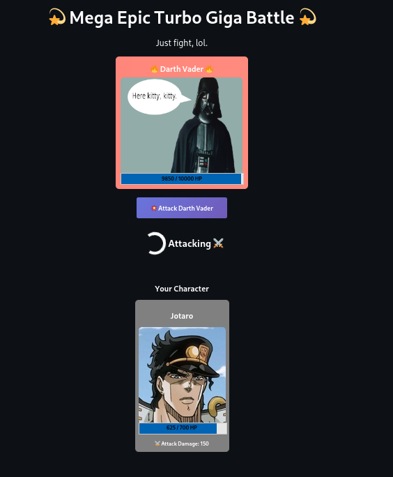

# NFT Practice

## Synopsis

A project to **learn** how NFTs work and practice smart contract development.

- On a web page user has the ability to connect MetaMask wallet and mint one of 3 NFTs.
- Each NFT has different health and attack values.
- Each user can only have one NFT.
- There's a boss with HP and attack value.
- User attacks the boss and gets attacked in return.
- On the back-end transaction occurs and updates NFT health values with each attack.

The stack of languages and tools I used:

- Back-end: Solidity, Hardhat, JS to handle the deployment.
- Front-end: ReactJS, Vite, ethers.js to connect front-end with the back-end.

## Showcase

## Notice

I tried my best to implement most of best practices when writing the smart contract:

1. All entities within contract have names which make sense.

2. Contract loosely follows the Solidity [style guide](https://docs.soliditylang.org/en/latest/style-guide.html):

3. Top-level declarations and all public interfaces (events and entities with public/external modifiers) are annotated according to the [NatSpec format.](https://docs.soliditylang.org/en/latest/natspec-format.html).

4. Deployment scripts are separated for local and Rinkeby testnet deployment (if I were to make a production project, I'd also make a third one for mainnet deployment).

Rinkeby testnet was used randomly :)

P.S. I tried to keep the front-end part tidy but didn't polish it the way I polished the smart contract because it wasn't the main focus of this project.
